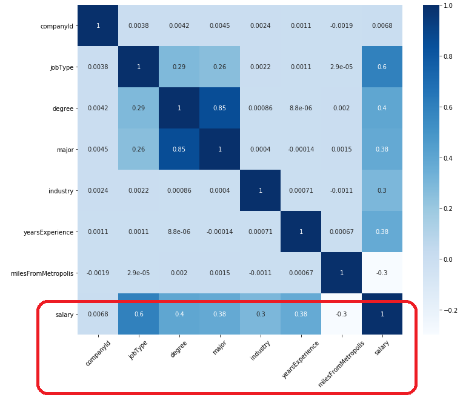

# SalaryPredictionProject

## Predict Salaries with Accuracy

  

#### DEFINE 

#### 1. Define The Business Problem
It is imperative that we accurately advise our clients on the salary that should be offer when advertising for a new employee. There are many problems with over or under estimating the salary on offer. Some examples are:
 - ##### Attracting the right candidates:  
     - Offering too little will attract only under qualified candidates
     - Offering too much may eliminate the advertisement from potential candidates search results.

 - ##### Staff Retention:
     - Underpaying staff can increase employee turnover 
     - Overpaying can trap employees when they are stale and ready to move up. 

The result being excessive time and money spent on recruitment in addition to reduced employee productivity.

  Our professional reputation depends on good advice.

 

##### The Task
Build a model to predict the salaries for a new set of 1 million job postings, based on the salaries of 1 million previous job advertisements.

#### Deliverables
- A file containing the salary predictions, where each row has the following format:
      jobId, salary
  - data\test_salaries.csv
- A pickle file containing the Model to deployed:
  - data\salary_predict_model.pkl
- Code to solve the problem:
  - SalaryPredictionEDA.ipynb
  - SalaryPredictionModeling.ipynb
- A Presentation on the project:
  - Salary_Prediction_Presentation.pdf

### DISCOVER
Discovery was undertaken in the file __SalaryPredictionEDA.ipynb__
#### 2. Obtain data (Data Collection)
All the data for this project was supplied by the project champion:
- __data\train_features.csv__: Details of 1 million job advertisments.\
Each row represents metadata for an individual job posting. 
The “jobId” column represents a unique identifier for the job posting. The remaining columns describe features of the job posting.
- __data\train_salaries.csv__: The corresponding Salaries for the 1 million training job postings. \
Each row associates a “jobId” with a “salary”.
- __data\test_features.csv__: Similar to train_features.csv. \
Each row represents metadata for an individual job posting.

The first row of each file contains headers for the columns. I was advised that the data may contain errors.

The testing and traininig files were loaded into __pandas dataframes__.\
The format of 'test_feature_df' and train_feature_df' are identical. Therfore no manipulation of columns was required.

  

The number of data points in 'train_feature_df' and 'train_target_df' are the same. \
Both 'train_feature_df' and 'train_target_df' have 'jobId' so this was used as the key to merge the dataframes to create a single dataframe, train_df.

  

#### 3. Clean data (Preprocessing)
The data requirted very little cleansing.
 - There were __no duplicate records__.
 - There were __no features with missing data__.
 - The only feature with __invalid data__ was 'salary'.
     - Five (5) records were deleted due to having invalid Salary data (salary was Zero).
     
The Key (jobId) was not used in exploration, training or for predicting. It was, of course, used when saving results.  
#### 4. Exploratory Data Analysis
##### IQR Rule
Using the IQR Rule the Upper Bound of salaraies was found to be 220.5 and the Lower Bound 8.5. (expressed in $ ,000)

__No erroneous outliers__ were found during Data Exploration.
Those that were suspicious were investigated and could be explained:

 - All roles above the Upper bound were mangement roles except for sixteen(16) Junior roles.
 - On further investigation the sixteen(16) Junior roles were found to be in the Oil and Finance industries which are known for paying high salaries.

No records were removed or modified as a result.

##### Label Encoding: 
The features with data type category were label encoded with the average salary for that category in that feature. ie
- CompanyId
- JobType
- Degree
- Major
- Industry
##### Correlation with Target
Categorical features were label encoded with the mean salary of each value for each Categorical feature. Along with Numeric Features, this label allowed me to then plot the relationship of all features to the salary with a correlation matrix.

  

 
Categorical features and Numeric features where then plotted seperatly.

  

  Categorical Correlation Map

   

  

  Numeric Correlation Map

 
The relationship between salary and other features was found to be (in order , from most closely related to least):

Features | Correlation Coefficient
------------ | -------------
JOB TYPE  (the factor with the greatest impact on salary)|0.6000
LEVEL OF EDUCATION (Degree)|0.4000
YEARS OF EXPERIENCE and MAJOR are equally correlated|0.3800
INDUSTRY and DISTANCE TO METRO are equally correlated|0.3000
COMPANY had the least impact on salary (consequently eliminated)|0.0068
 
                                                       
#### 5. Set baseline outcomes
A basic Linear Regression model was used to establish a baseline for prediction accuracy without fitting, feature generation or tunning.
- __Benchmark Model – LinearRegression	      MSE: ~399.8__

#### 6. Hypothesize solutions
##### Correlations
The strength of the relationships between Salary and each of the following features:
- jobType
- degree
- major
- industry
indicates a need to account for categories within them in some way in future models.

##### Models
Supervised Machine Learning algorithms, specifically 
Regression and Ensembles of Regression Algorithms suit our data and our goal.  
3 models were selected:
Model | Reasoning
------------ | -------------
LinearRegression|Sometimes simple is best
RandomForestRegressor|Offers Improved accuracy and control over-fittings
GradientBoostingRegressor|Can optimise on Least squares regression.
 
#### DEVELOP
Model Development was undertaken in __SalaryPredictionModeling.ipynb__
 
#### 7. Engineer features
New features were generated by calculating summary statistics for each group based on groupings of 
- jobType
- degree
- major
- industry

These groupings generatied the new features:
- group_mean
- group_max
- group_min
- group_std
- group_median

Excluding the companyId from this feature ensures that it will be possible to predict salaries for new companies in the future. The trade of is that the accuracy will be slightly reduced by not accounting for the companyId. companyId has a very low importance.

  

#### 8. Create models
Models were created using the following 3 Algorithms:
- LinearRegression
- RandomForestRegressor		  
- GradientBoostingRegressor
 
##### Hyper parameter tuning
 - RandomForestRegressor
     - 60 estimators, max depth of 15, min. samples split of 80, max. features of 8
 - GradientBoostingRegressor
     - 40 estimators, max. depth of 7, loss function used was least squares regression.
     
##### Cross validation
 - 5-fold cross validation
     - scoring = neg_mean_squared_error
     
#### 9. Test models
Models were evaluated using Mean Squared Error (MSE) 
The lower the MSE the better the prediction.

__Our goal is to achieve an MSE <320__
Model | Reasoning
------------ | -------------
BENCHMARK – LinearRegression | MSE: ~399.8
LinearRegression (after Feature Engineering) | MSE: ~358.2
RandomForestRegressor | MSE: ~313.6
BEST - GradientBoostingRegressor | MSE: ~313.1

#### 10. Select best model
##### GradientBoostingRegressor model was selected.
With Hyperparameters of:
 - estimators = 40,
 - max_depth of 7,
 - loss function used was 'least squares regression'.
 - learning_rate (default=0.1)

##### Achieving a 22% improvement over the basic Linear Regression baseline model.

#### DEPLOY (out of scope for thois project)
##### 11. Automate pipeline
##### 12. Deploy solution
##### 13. Measure efficacy
 
 
 

## How does the GradientBoostingRegressor algorithm work?
GradientBoostingRegressor is an ensemble (decision tree and boosting) regression (ie based on Linear Regression) algorithm.\
Gradient refers to the loss function (residual error) which we want to progressively reduce (gradient descent). ie negative loss function.\
It makes predictions sequentially. The subsequent preditions learn from the mistakes in previous predictions (Boosting).

More precissly:
 1. A 'leaf' is created which is the average of all values of the response (salary) variable. This is the baseline.
 2. Each record or sample has its residual calculated. (the difference between it and the baseline)
 3. Then a tree is created where each leaf is a residual prediction. If insufficient leaves, multiple residuals will be averaged and that will be the value of the leaf. Each feature is used to construct the branches of the decision tree. 
 4. Now pass each record through the decision tree. The value of the leaf it arrives at is the prediction for that record.
 5. Compute the residuals again using the predition.
 6. Repeat steps 3 to 5 (createing a new tree each time) until the number of iterations specified in the hyperparameter is reached.
 7. Use all of the trees in the ensemble to make a final prediction. Prediction will = (baseline + all predictions) * learning rate.

The 'depth' of each tree, the 'learning rate' and the number of iterations or trees ('estimators') and the measure of the 'loss function' are set in the Hyperparameters, if not set default values are used. 

  

Ensembling Image Credit:
https://medium.com/mlreview/gradient-boosting-from-scratch-1e317ae4587d

References:
https://towardsdatascience.com/machine-learning-part-18-boosting-algorithms-gradient-boosting-in-python-ef5ae6965be4
https://medium.com/mlreview/gradient-boosting-from-scratch-1e317ae4587d
https://scikit-learn.org/stable/modules/generated/sklearn.ensemble.GradientBoostingRegressor.html
     
